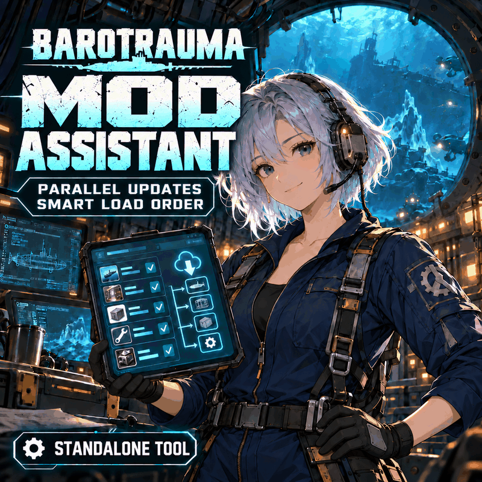

# 工坊分发包

将 v0.6.1 的独立程序作为工坊内容包的附带文件分发。`filelist.xml` 为没有游戏资源条目的普通包，不注册可执行文件或脚本，不自动启动助手。用户手动运行 `安装到桌面.cmd` 或英文入口 `Install-to-desktop.cmd`，复制程序到个人目录并建立桌面快捷方式。

`description.bbcode.txt` 是 Steam 页面的中文简介，`description.en.bbcode.txt` 是英文简介，`FIRST_READ.txt` 是订阅后本机说明。实际编号为 `3812360206`，构建分发包时写入 filelist 的 `steamworkshopid`；发布记录在 `publication.json`。当前主封面为英文灯光循环 GIF `cover-en.gif`，`cover.jpg` 为订阅包附带的英文静态兼容图。英文原图在 `assets/cover-en.png`，灯光增强帧在 `assets/cover-en-bright.png`；先前认可的中文原图留存在 `assets/cover-final.png`。弃用的错误版本不纳入发布包。六张中英文界面截图使用虚构示例清单，未公开个人模组列表。

项目通过 Steam 的语言设置分别维护 `schinese` 和 `english` 标题与简介，保留作者修改后的标题。项目已公开。v0.6.1 程序右上角提供即时中文/英文切换，附带英文使用说明与桌面安装入口；两个页面顶部均提供公开源码和最新下载链接。上传后逐语言回读核验简介，并下载工坊内容逐文件校验。

构建与上传操作记录放在忽略的 `.release-staging` / `Research`，不把本机路径、账号信息或玩家配置纳入发布包。上传清单严格列出允许的九个文件，不把整个项目目录作为工坊内容提交。GitHub 仓库经作者授权公开：[源码](https://github.com/laohei-moddeveloper/barotrauma-mod-assistant)、[最新下载](https://github.com/laohei-moddeveloper/barotrauma-mod-assistant/releases/latest)。工坊安装也可独立完成。

技术依据：游戏的 [内容包文档](https://regalis11.github.io/BaroModDoc/Intro/ContentPackages.html)、[安装目录复制逻辑](https://github.com/FakeFishGames/Barotrauma/blob/master/Barotrauma/BarotraumaShared/SharedSource/Steam/Workshop.cs) 和 Steam 的 [工坊接口](https://partner.steamgames.com/doc/api/ISteamUGC)。游戏复制包目录里的附带文件；内容加载仍由 filelist 中的资源条目决定。

封面提示词和生成方式见 [cover-prompt.md](cover-prompt.md)。插画、英文文字和两帧灯光均使用内置 imagegen 编辑，保留右手持平板、左手扶腰的姿势。`tools/encode_workshop_cover.py` 仅将完成的图片调整输出尺寸并转换、编码为 GIF/JPEG，不绘制或修改插画。GIF 为 800×800、两帧、2.2 秒循环、843577 字节。Steam 上传后返回的预览文件与本地 GIF 逐字节一致，保留两帧和无限循环；订阅包的九个文件亦已回下载校验，程序仍为 v0.6.1。

封面由中英文页面共用；标题、简介通过 Steam 的语言选项分别显示。英文标题和简介已通过 Steam 的 `english` 查询回读核验，介绍中不再包含中文字符。公开网页本次请求被 HTTP 429 限流，因此没有声称完成网页界面的直接目视核验。

